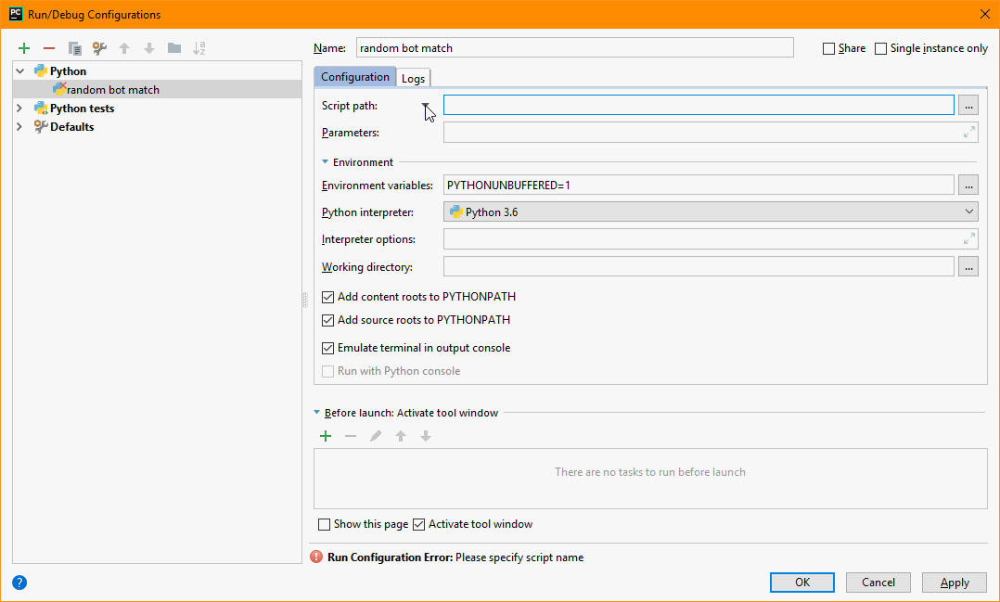

Debugging your bot
==================

Debugging with PyCharm
----------------------

You can create a run configuration to run your bot from PyCharm by targeting one of the scripts provided for running
bots, like :code:`reconchess.scripts.rc-bot-match` or :code:`reconchess.scripts.rc-play`, as a module:

You can then choose to run the configuration you made in debug mode, and PyCharm will hit any breakpoints you set. It
can do this because :code:`rc-bot-match` and :code:`rc-play` load your bot code into the same python process
(see :func:`reconchess.load_player`).

Debugging with output
---------------------

You can use ordinary print statements in your bot, and they will appear on the command line if you use
:code:`reconchess.scripts.rc-bot-match` or :code:`reconchess.scripts.rc-play`. If you want to your output to go to a file,
use a logging library (e.g. the built in logging module).
