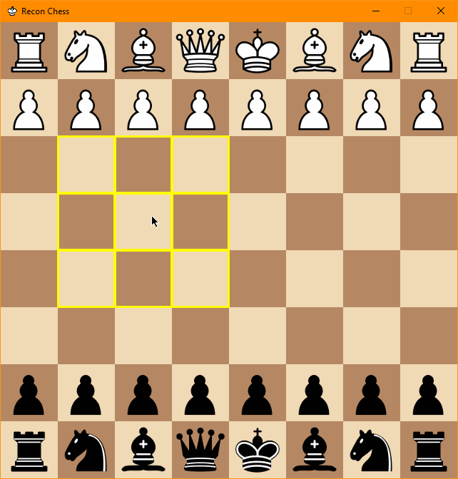
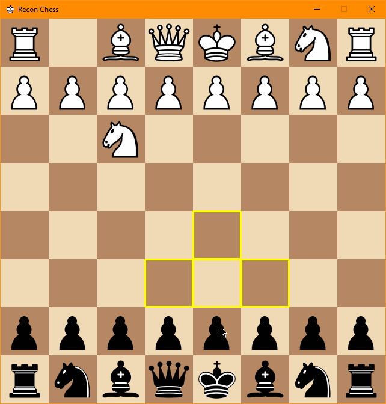
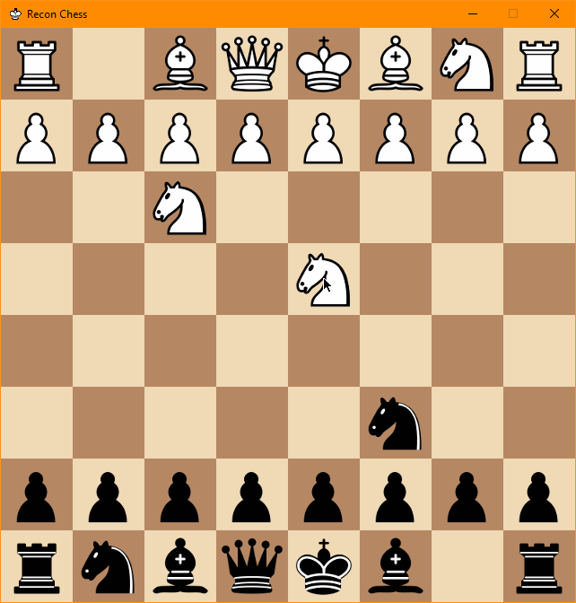
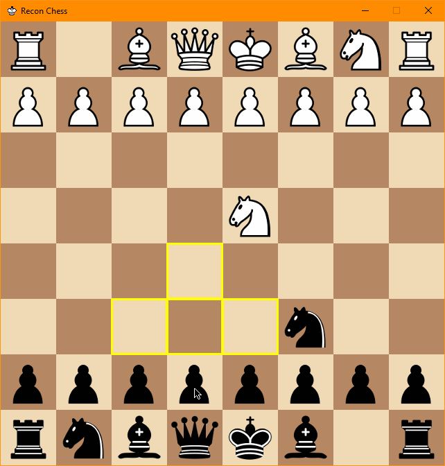

Playing games
=============

Bot vs Bot
----------

Command Line
^^^^^^^^^^^^

Playing two bots against each other is as easy as playing against your bot, using the built in script :code:`rc-bot-match`.
Similar to :code:`rc-play`, :code:`rc-bot-match` gets added to your path so you can execute it from the command line.
It takes two bots and plays them against each other using a :class:`LocalGame`:

.. code-block:: bash

    rc-bot-match --help
    rc-bot-match <white bot> <black bot>
    rc-bot-match reconchess.bots.random_bot src/my_awesome_bot.py
    rc-bot-match reconchess.bots.random_bot reconchess.bots.random_bot
    rc-bot-match src/my_okay_bot.py src/my_awesome_bot.py

Use the :code:`--help` flag for more information about the arguments.

PyCharm
^^^^^^^

If you use PyCharm for development, you can create a run configuration to run your bot from PyCharm by
creating a new run configuration that targets a module instead of a script. Target the
:code:`reconchess.scripts.rc-bot-match` module:

.. image:: _static/pycharm_bot_match_config.gif
    :target: _static/pycharm_bot_match_config.gif

Playing against your bot
------------------------

Playing against your bot is very easy with the built in script :code:`rc-play`. When you install the reconchess package,
the rc-play script gets added to your path so you can run it like an executable. :code:`rc-play` expects an argument
that will point it to the bot to play against. It uses :func:`reconchess.load_player` to load the bot, so it can accept
either a path to a python source file, or a python module name. To play against one of your own bots you will use
a path to the source file.

In either case, rc-play will create an instance of the provided bot, and a :class:`reconchess.LocalGame`. It will then open
up a window using PyGame that you can play against the bot with. rc-play handles running the :class:`reconchess.LocalGame`,
and interfacing your actions with the game.

.. code-block:: bash

    rc-play --help
    rc-play <path to bot source file or bot module>
    rc-play reconchess.bots.random_bot
    rc-play src/my_awesome_bot.py

Use the :code:`--help` flag for more information about the arguments.

Sensing
^^^^^^^

When it is your turn to sense, the squares under your mouse will be highlighted, indicating which squares will be
sensed if you choose the square underneath your mouse.

**Click the square to select it as the sensing action.**

Moving
^^^^^^

When it is your turn to move (after sensing), hovering over a piece will indicate the move actions you can take.
Note that just because a move is shown doesn't mean it is valid.

**Click and drag a piece to one of the highlighted squares to make a move action.**

Changing pieces on the board
^^^^^^^^^^^^^^^^^^^^^^^^^^^^

If you ever want to adjust the pieces on your board, for example if you know a piece isn't there, you can
**right click a square to cycle through the possible pieces**.

Captures
^^^^^^^^

If you capture a piece, or one of your pieces is captured, the square will be highlighted in red for the remainder
of the turn.

