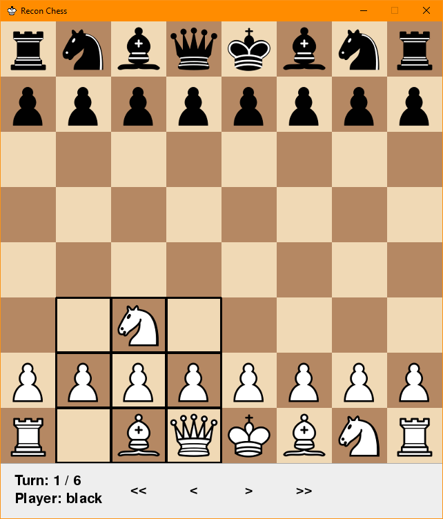
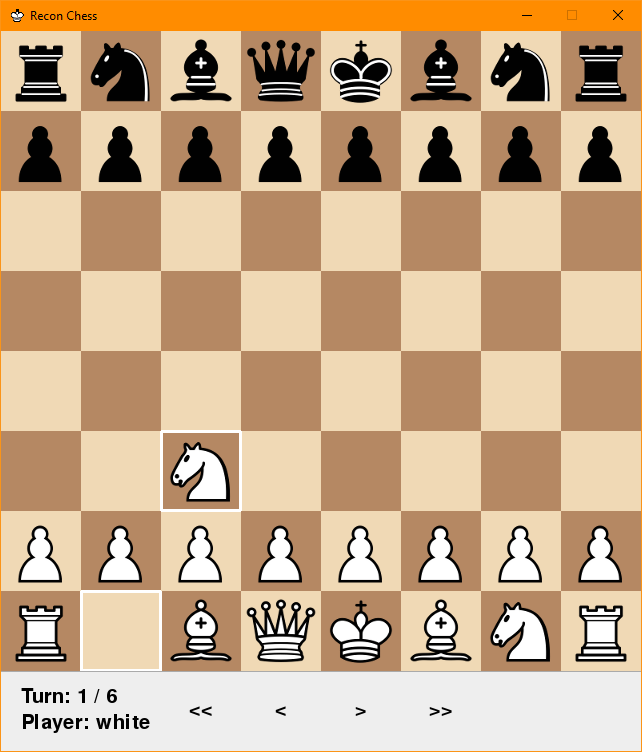
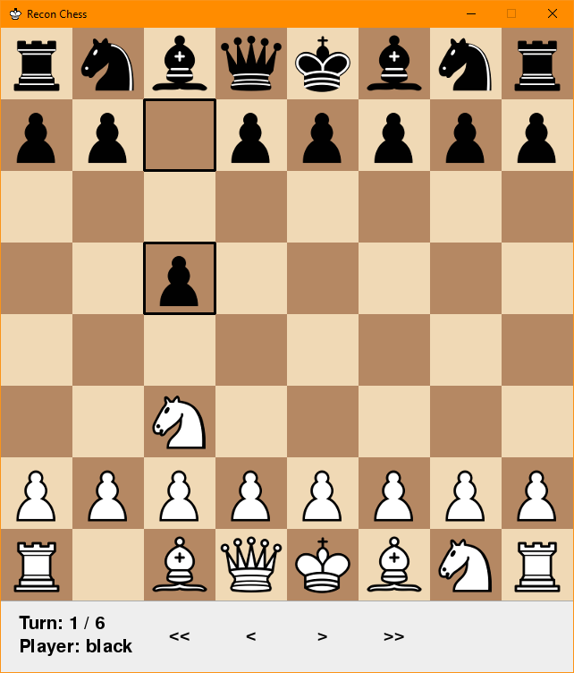
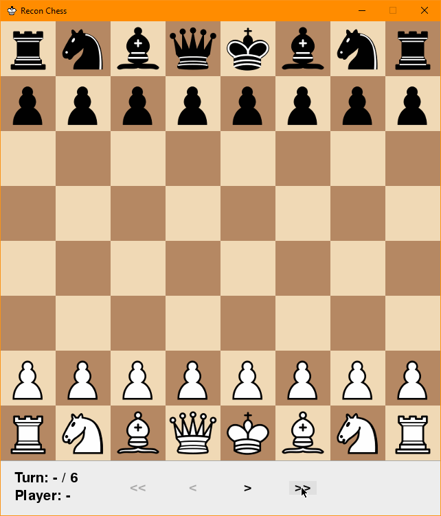
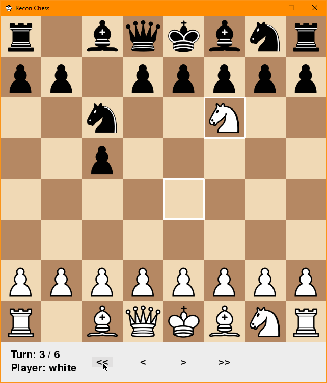
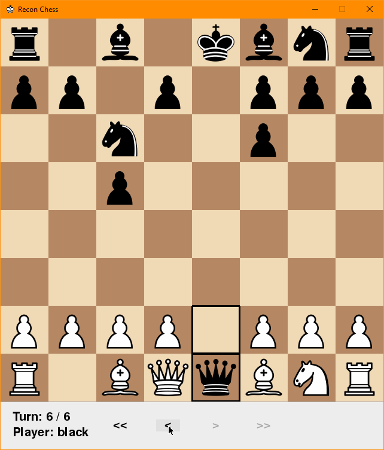

Replaying games
===============

You can replay a game that was already played using the built in script :code:`rc-replay`. When you install the
reconchess package, the rc-play script gets added to your path so you can run it like an executable.
:code:`rc-replay` expects an argument that points to a saved game history file, which will be a JSON file.
:code:`rc-play` and :code:`rc-bot-match` automatically save a game history file in the directory where they are run,
so you can use those files as input to :code:`rc-replay`. See :meth:`reconchess.Player.handle_game_end` for using the
game history object and :meth:`reconchess.GameHistory.save` for saving it.

.. code-block:: bash

    rc-replay --help
    rc-replay <path to saved game history file>
    rc-replay crazy_game.json

Use the :code:`--help` flag for more information about the arguments.

Sense Action
------------

Senses are shown by highlighting the squares that the sense covered in the color of the player.

Here the white player senses over black's knight at B8:

.. image:: _static/white_sense.png
    :target: _static/white_sense.png

Here the black player senses over white's pawn at C2:

Move Action
-----------

Moves are shown by highlighting the square the piece moved from, and the square the piece moved to.

Here the white player moves their knight from B1 to C3:

Here the black player moves their pawn from C7 to C5:

Stepping through the game
-------------------------

There are 4 buttons at the bottom of the window that you can use to step through the game.

Going to Last Action
^^^^^^^^^^^^^^^^^^^^

The :code:`>>` button goes to the last action of the game.

Going to Start of Game
^^^^^^^^^^^^^^^^^^^^^^

The :code:`<<` button goes to the start of the game.

Stepping Backward
^^^^^^^^^^^^^^^^^

The :code:`<` button goes to the previous action taken.

Stepping Forward
^^^^^^^^^^^^^^^^

The :code:`>` button goes to the next action taken.

.. image:: _static/forwards.gif
    :target: _static/forwards.gif
